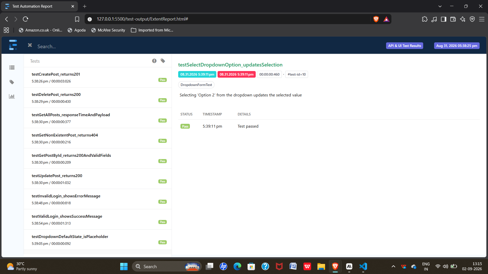

# Test Automation Framework


A Java-based test automation project demonstrating API testing, UI testing,
and automated HTML reporting — built to showcase practical QA/SDET skills.

## What this project does

This is a self-contained Maven project with two independent test layers:

1. **API tests** (`src/test/java/api`) — REST Assured tests against
   [JSONPlaceholder](https://jsonplaceholder.typicode.com), a free public
   fake REST API. They validate:
   - Successful GET requests (`200`)
   - Resource-not-found handling (`404`), including a **data-driven** test
     across multiple invalid post IDs
   - Resource creation (`201`) with payload validation
   - Update (`PUT`) and delete (`DELETE`) flows
   - Basic response-time (latency) assertions

2. **UI tests** (`src/test/java/ui`) — Selenium WebDriver tests against
   [the-internet.herokuapp.com](https://the-internet.herokuapp.com), a
   public site built for Selenium practice. They cover:
   - A login form with valid and invalid credential flows, including a
     **data-driven** test across multiple invalid username/password
     combinations
   - A dropdown form-element interaction
   - Built using the **Page Object Model**, so locators and page actions
     are separated from test logic

Both suites run together under **TestNG**, with results compiled into an
**HTML report** via **ExtentReports**, and the whole suite runs automatically
on every push via **GitHub Actions CI**.

## Tech stack

| Purpose            | Tool                          |
|--------------------|--------------------------------|
| Build tool          | Maven                          |
| Test runner         | TestNG                         |
| API testing         | REST Assured                   |
| UI/browser testing  | Selenium WebDriver (Chrome)    |
| Driver management   | WebDriverManager (Bonigarcia)  |
| Reporting           | ExtentReports (Spark reporter) |
| CI                  | GitHub Actions                 |
| Language / runtime  | Java 17                        |

## Project structure
test-automation-framework/
├── .github/workflows/ci.yml # GitHub Actions CI pipeline
├── pom.xml # Maven dependencies & build config
├── testng.xml # TestNG suite: which tests run, listeners
├── README.md
└── src/test/java/
├── api/
│ └── PostsApiTest.java # REST Assured API tests (incl. data-driven)
├── ui/
│ ├── LoginTest.java # Selenium login tests (incl. data-driven)
│ └── DropdownFormTest.java # Selenium dropdown tests
├── pages/
│ ├── LoginPage.java # Page Object for the login page
│ └── DropdownPage.java # Page Object for the dropdown page
└── listeners/
└── ExtentReportListener.java # TestNG -> ExtentReports bridge

## Prerequisites

- Java 17+ (`java -version`)
- Maven 3.8+ (`mvn -version`)
- Google Chrome installed locally (WebDriverManager downloads the matching
  driver automatically — you don't need to install chromedriver yourself)

## How to run

Clone or download the project, then from the project root:

```bash
mvn test
```

This will:
1. Download dependencies
2. Run all API tests (fast, no browser needed)
3. Run all UI tests in headless Chrome
4. Generate the HTML report at:

test-output/ExtentReport.html

Open that file in any browser to view the results. The same run also
happens automatically on every push via the GitHub Actions workflow in
`.github/workflows/ci.yml`.

### Running only one suite

```bash
mvn test -Dtest=PostsApiTest
```

## Sample report



All 18 tests (10 API + 8 UI) passing via `mvn test`.

## Design notes / talking points

- **Given-When-Then structure** in the API tests mirrors REST Assured's
  fluent DSL and doubles as living documentation of each test's intent.
- **Page Object Model** keeps locators and page actions out of test
  methods, so a UI change only requires updating one page class instead
  of every test that touches that page.
- **Data-driven tests** (`@DataProvider`) run the same test logic against
  multiple inputs — invalid post IDs for the API, invalid credential
  combinations for the login form — without duplicating test code.
- **Explicit waits** (`WebDriverWait` + `ExpectedConditions`) were added
  after CI runs surfaced a timing issue that didn't reproduce locally —
  a good example of why explicit waits beat assuming instant page loads.
- **Headless Chrome** lets the UI suite run in CI environments without a
  display.
- **ExtentReports is wired in via a TestNG listener**, not inside the test
  classes — this keeps reporting concerns fully decoupled from test logic.
- JSONPlaceholder's write endpoints (`POST`/`PUT`/`DELETE`) are simulated:
  they return the correct status codes and echo the payload, but don't
  persist data server-side.

## Possible extensions

- Add an `IRetryAnalyzer` to automatically retry flaky UI tests
- Parameterize environments (dev/staging) via `testng.xml` or system properties
- Add Allure as an alternative/additional reporting option